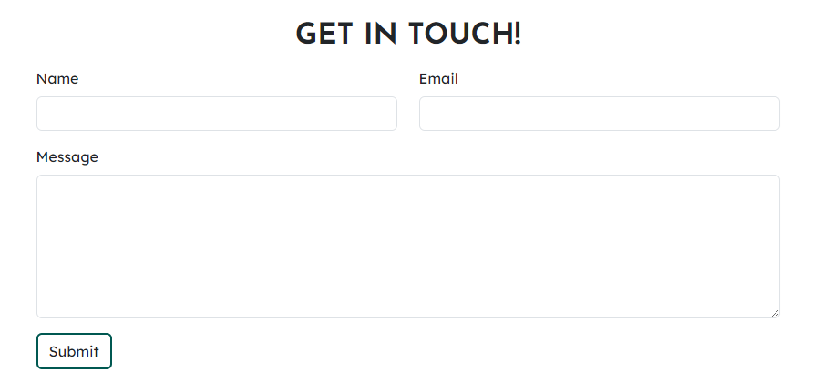
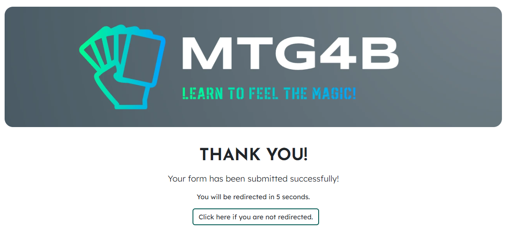

# Magic: the Gathering for Beginners (MTG4B)

## Code Institute - First Milestone Project: User Centric Frontend Development.

## Table of Contents

+ [Live Demo](#demo)
+ [UX](#ux)
+ [User Stories](#user-stories)
  + [Strategy](#strategy)
+ [Scope](#scope)
  + [Structure](#structure)
  + [Skeleton](#skeleton)
  + [Surface](#surface)
+ [Technologies](#technologies)
+ [Features](#features)
+ [Deployment](#deployment)
+ [Validator Testing](#validator-testing)
+ [Credits](#credits)

## Demo
A live demo to the website can be found [here](https://arcandrus.github.io/milestone-1/index.html)

## UX
This website is designed for beginners interested in learning the basics of the card game Magic: the Gathering (MTG). The user experience is geared towards explaining how to get started playing MTG and providing ansers to basic questions as well as the ability to contact the site creators for furthur information.

## User Stories
My goal is to create a simple, easy to follow explanation of the cards types and the basics of how to play MTG. The points I considered with the user in mind are as follows:

+ As a user, I want to understand the purpose of this website quickly and easily.
+ As a user, I want to easily navigate this website (by using a mouse, a keyboard, or a touch screen).
+ As a user, I want to be able to gain a foundation of knowledge to play MTG.
+ As a user, I want to be able to find more information about where and how I can play.
+ As a user, I want access to further general information if I should choose to.

## Strategy
The goal is to make a well-functioning, fun website that is engaging for the user. The focus was on making the design both user-friendly and creative.

## Scope
For the users (people interested in the basics of MTG), I wanted to give them a good overview of the basic rules and structure of MTG and how to get started playing as well as options to gain furthur information should they choose to. This way, the user can leave the website after exploring the content having a solid understanding of how to start playing MTG and what the cards mean and do within the game.

## Structure
I felt that there were three key areas I wanted to focus on. They are a little history and explanation of the game, a summary of the rules of the game and an explanation of the various card types in the game. As such, the structure fell rather naturally into three pages.

**Home**: An introduction to the MTG universe.

**Getting Started**: A brief explanation of the basics of the game, including a video link with a tutorial video.

**Card Types Explained**: An overview of the different types of cards players can expect to see in the game.

**Contact**: I've also decided to add a contact section so users can directly get it touch with the creator if they have more specific questions not covered within the scope of the website.

## Skeleton
I wanted to have a consistent appearance across all pages for ease of use. As such, the three pages follow a very similar template, which I find to be easy to follow and understand.

A Wireframe for the website was designed using Balsamiq and was arranged in such a fashion as to keep a consistent feeling and design across all pages.

The Wireframe design can be found [here](./readme-assets/mtg-wireframe.pdf) (pdf format).

## Surface
I created a logo using [Looka](https://www.looka.com) and used that logo to decide a cohesive color scheme.

## Technologies
**HTML** - To create a basic site skeleton and add the content.

**CSS** - To create a bold but usable front-end and to give a great user experience

**Balsamiq** - To create a wireframe

# Features
## Consistent Features

### Navbar and Header

Clear and readable title and Navigation bar. The Navbar is enclosed within the header which is fixed to the top of each page ensuring constant access to all pages of the website. There is also a clear colorization to the currently active link ensuring the user can always refer back and know where they are within the site structure.
On smaller screens, such as tablets, the navbar and header resize to ensure readability and the navbar collapses into a dropdown menu.

### Footer

A consistant footer has been added to each page including links to five social networks.

## Page Features

### Home
There is a brief introduction and explanation of the websites goal and history of MTG.
There is a link to the Wizards of the Coast Locator service, which can help new players find places to play MTG.

### Getting Started
This page features a link to a target="_blank" page that will display a video tutorial from the MTG YouTube channel. This was done using hte YouTube embedded iframe, which I styled in CSS to make it fit with my themes.

### Card Types Explained
Using a customized card layout, this page features a display of written explanation and pictures to show each card type and give a summary of how the card works in the game.

On smaller screens, the picture is moved to be displayed above its text. This was implemented to allow the page to retain readability while still allowing access to a picture example.

### Contact
A contact page allows users to get in touch with the creator of the website to ask any questions they may have. Each field is required to submit the form and will prompt the user to add to any blank input before continuing. A success page has been used to provide feedback directly to the user after completion of the form. I have implemented a simple Javascript countdown and auto redirect as well as including a button backup to return the user to the homepage after the form has been submitted.

## Deployment
The site has been deployed using [GitPages](https://pages.github.com) in the following way.
+ In the Github repository, the Setting tab.
+ Under General, navigate to Code and Automation and select 'Pages'.
+ In the Build and Deployment section for Source, select 'Deploy from a branch' from the drop-down list.
+ For Branch, select 'main' from the drop-down list and Save.
+ On the top of the page, the link to the complete website is provided.
+ The deployed site will update automatically upon new commits to the master branch.

## Validator Testing
**HTML** No errors when tested using [W3C Validator](./readme-assets/html-pass.png)

**CSS** No errors when tested using [Jigsaw Validator](./readme-assets/css-pass.png)

**Accessibility** Confirmation that my site passed accessibility when tested using [Lighthouse DevTools](./readme-assets/lighthouse-pass.png)

I have also asked several users to explore the website on different devices including iPhone 14, iPad, Oppo mobile devices, Sony mobile devices and several different PC and Laptop setups to ensure consitency and usability across multiple platforms.  

## Credits

[MDN WebDocs](https://developer.mozilla.org/en-US/), [W3Schools](https://www.w3schools.com) and [Stack Overflow](https://stackoverflow.co/teams/) were used to help general understanding and troubleshooting specific problems as I progressed.

I would also like to thank my mentor, Medale Oluwafemi, for his insights and support during this project and my friends Rew and Emma who have helped me with testing and troubleshooting.
